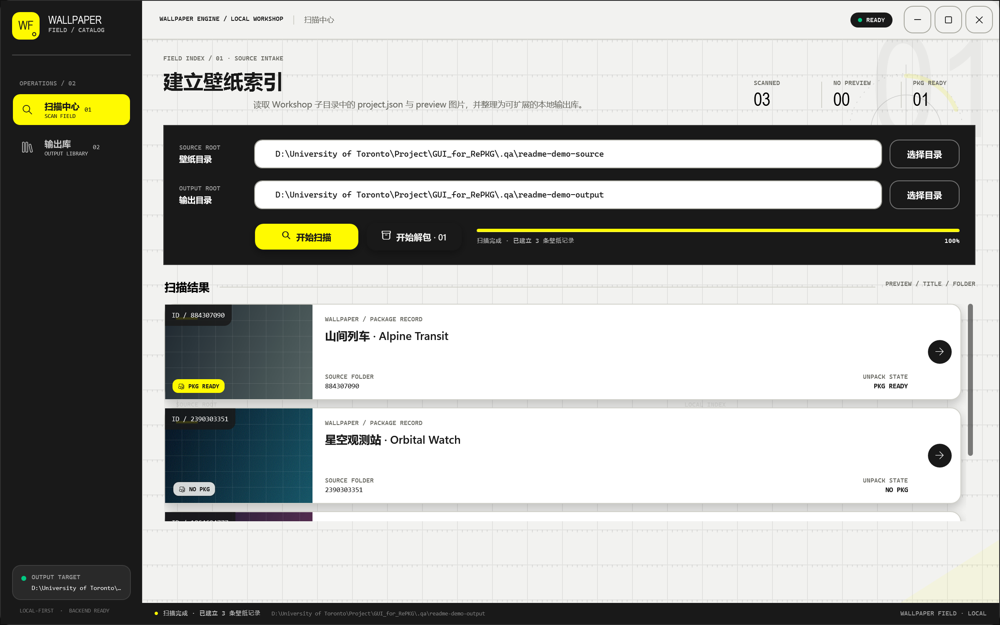
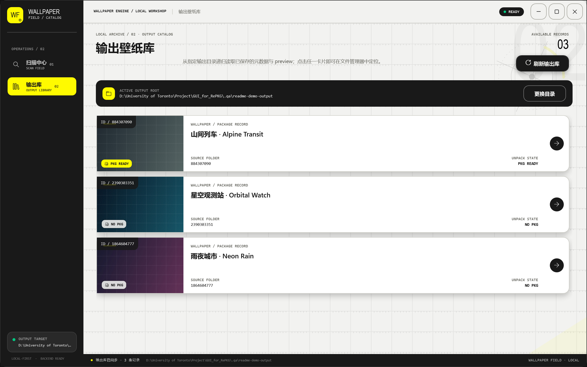

# Wallpaper Field

一款面向 Windows 的 Wallpaper Engine 本地壁纸整理与 `scene.pkg` 解包工具。程序使用 C# / WPF 编写，可以只读扫描 Workshop 壁纸目录、直接显示源 preview，并按用户勾选解包场景壁纸或复制视频壁纸。

> [!NOTE]
> 这是一个非官方社区项目，与 Wallpaper Engine、Arknights: Endfield、Hypergryph 或其关联公司无隶属或背书关系。界面采用原创的 Endfield-inspired 技术终端风格，不包含官方徽标、角色图、宣传素材或字体。



_扫描中心：显示 preview、标题、Workshop ID 和可处理状态；所有项目均有复选框且默认不选。_



_输出壁纸库：重新读取输出目录；点击卡片即可在 Windows 文件资源管理器中打开对应文件夹。_

## 功能概览

- 扫描 Wallpaper Engine Workshop 根目录下的所有直接子文件夹。
- 从 `project.json` 读取 `title`、`workshopid`、`type` 和 `file`，字符串或数字形式的 Workshop ID 均可识别。
- 识别 `preview.png`、`preview.jpg`、`preview.jpeg` 和 `preview.gif`；卡片直接读取源文件，不复制 preview。
- GIF preview 会在可见卡片中逐帧播放；离屏卡片暂停播放，系统启用“减少动态效果”时显示静态帧。
- 正常关闭程序时记住源壁纸目录和输出目录，下次启动自动恢复，无需重复输入。
- 扫描全程只读，结果保存在当前运行会话的内存中，不会创建输出根目录、项目目录或任何索引文件。
- 所有扫描卡片均提供复选框且默认不选；只有勾选的可处理项目才会进入后续操作。
- 识别项目根目录中的 `scene.pkg`，并识别 `project.json` 中 `type` 为 `video`、`file` 指向有效相对路径的视频项目。
- 使用内置 RePKG 解包 PKG，并执行默认的 TEX 图片转换与 `.tex-json` 元数据生成。
- TEX 只作为当前解包任务的临时转换输入；转换完成或失败后都会删除，不写入最终壁纸库。
- 处理视频项目时，将视频复制到对应项目的 `unpacked` 目录并保留 `file` 的相对路径。
- 仅在单个项目处理成功后写入该项目的 `metadata.json`，供输出壁纸库重新加载。
- 从输出目录重建已成功处理的壁纸库；点击任意卡片可定位到对应目录。
- 扫描结果和输出壁纸库均可按标题实时搜索；过滤不会清除已勾选项目。
- 大型壁纸库使用回收式列表虚拟化和异步图片解码，深度滚动时不会反复创建全部卡片。
- 扫描与解包均有进度、取消、逐项错误隔离和安全路径检查。
- 发布版是 Windows x64 自包含单文件 EXE，不需要另外安装 .NET 或 RePKG。

## 运行要求

### 普通用户

- Windows 10 或 Windows 11，64 位系统。
- Wallpaper Engine 的本地 Workshop 内容，或拥有相同目录结构的离线副本。
- 足够的输出磁盘空间。解包后的体积通常会明显大于原始 `scene.pkg`。

根目录中的 `GUI_for_RePKG.exe` 已包含 .NET 运行时和所需的 RePKG 代码。正常使用不需要管理员权限，也不需要单独下载或启动 `RePKG.exe`。

### 从源码构建

- Windows 10/11。
- [.NET 10 SDK](https://dotnet.microsoft.com/download/dotnet/10.0)。

## 快速开始

1. 下载 Windows x64 发布包并完整解压；如果直接获取了仓库，运行根目录中的 `GUI_for_RePKG.exe`。
2. 在左侧打开“扫描中心”。
3. 选择 Wallpaper Engine 壁纸根目录。
4. 选择一个专门的输出目录。
5. 点击“开始扫描”，等待卡片和统计信息出现。扫描不会修改输出目录。
6. 可在结果上方输入标题关键词，快速缩小卡片范围。
7. 勾选要处理的壁纸；所有复选框默认不选。
8. 点击“解包选中项”。程序只处理已勾选的 `PKG READY` 或 `VIDEO READY` 项目。
9. 打开左侧“输出壁纸库”，刷新、搜索并浏览已成功处理的内容。

下面是每一步的详细说明。

## 使用教程

### 1. 找到 Wallpaper Engine Workshop 目录

Wallpaper Engine 的 Steam App ID 是 `431960`。默认 Steam 库常见路径为：

```text
C:\Program Files (x86)\Steam\steamapps\workshop\content\431960
```

如果 Steam 库位于其他磁盘，路径通常为：

```text
<SteamLibrary>\steamapps\workshop\content\431960
```

例如：

```text
E:\SteamLibrary\steamapps\workshop\content\431960
```

选择的是 `431960` 这一层，而不是某一个具体数字 ID 的文件夹。程序只扫描它的直接子文件夹，例如：

```text
431960\
├─ 884307090\
├─ 1864604777\
└─ 2390303351\
```

你可以直接在输入框中粘贴路径，也可以点击右侧的目录选择按钮。正常关闭程序后，这两个路径会保存到当前 Windows 用户的本地设置中，并在下次启动时自动恢复；命令行测试参数仍可临时覆盖它们。

### 2. 选择输出目录

输出目录用于保存已勾选且处理成功的项目。建议选择一个专用目录，例如：

```text
D:\WallpaperFieldOutput
```

> [!IMPORTANT]
> 源目录和输出目录不能相同，也不能互相包含。请不要把输出目录放进 `431960`，也不要把 `431960` 放进输出目录；这样可以避免输出文件被再次当成扫描源。

扫描只读取源壁纸目录，既不会创建输出目录，也不会在其中写入任何文件。点击“解包选中项”后，程序才会为已勾选项目创建输出并写入解包内容、视频副本和单项元数据。preview 始终链接到源文件，不会复制到输出目录。若输出内容重要，仍建议定期备份。

### 3. 开始扫描

确认两个路径后，点击“开始扫描”。程序会逐个只读检查 `431960` 下的直接子文件夹，并执行以下操作：

1. 查找并读取 `project.json`。
2. 获取其中的 `title`、`workshopid`、`type` 与 `file`。
3. 查找 preview 图片，并记录其源文件路径供卡片直接显示。
4. 检查项目根目录是否存在 `scene.pkg`，或是否为引用有效文件的 video 项目。
5. 在扫描中心生成对应卡片和复选框。

扫描结果只存在于当前运行会话的内存中。此阶段不会创建输出根目录、项目目录、preview 副本、元数据或索引文件。

卡片会显示：

- preview 图片；没有可用图片时显示“无信息”。
- `title`；无法读取时使用文件夹名作为回退标题。
- `workshopid`；缺失或无效时使用文件夹名作为回退识别码，并显示警告。
- `PKG READY`、`VIDEO READY` 或无可处理内容状态。
- 一个默认未选中的复选框；无可处理内容时复选框不可用。
- 元数据缺失、preview 缺失等非致命警告。

单个项目损坏不会终止整个扫描。完成后请查看页面顶部的提示区域，确认是否有项目需要手动检查。

如果多个源文件夹最终得到相同的 Workshop ID，程序会保留先处理的项目，并把后续重复项记录为失败，避免不同壁纸覆盖到同一个输出目录。

### 4. 理解输入文件规则

每个壁纸项目的典型结构如下：

```text
884307090\
├─ project.json
├─ preview.png
├─ scene.pkg
└─ ...其他 Wallpaper Engine 文件
```

| 文件 | 是否必需 | 读取方式 |
| --- | --- | --- |
| `project.json` | 建议存在 | 文件名和字段名不区分大小写；读取 `title`、`workshopid`、`type` 与 `file` |
| `preview.*` | 可选 | 只查找项目根目录；支持 PNG、JPG、JPEG、GIF；直接从源文件显示 |
| `scene.pkg` | 场景壁纸必需 | 只识别项目根目录中的同名文件，文件名不区分大小写 |
| `file` 指向的视频 | 视频壁纸必需 | `type` 必须为 `video`；`file` 必须是项目目录内存在的安全相对路径 |

preview 的选择优先级为 PNG → JPG → JPEG → GIF。程序直接读取源 preview。GIF 会在当前可见卡片中按原始帧时长与循环设置播放，滚出可视区域后暂停；系统启用“减少动态效果”时保持为静态帧。图片数据先读入内存，因此播放期间不会锁住源文件。

一个最小的 `project.json` 示例：

```json
{
  "title": "My Wallpaper",
  "workshopid": "884307090",
  "type": "scene",
  "file": "scene.json"
}
```

视频项目通常使用以下字段：

```json
{
  "title": "My Video Wallpaper",
  "workshopid": "1864604777",
  "type": "video",
  "file": "media/wallpaper.mp4"
}
```

`workshopid` 也可以是 JSON 数字。输出目录以最终识别到的 Workshop ID 命名。视频 `file` 可以包含子目录，但不能是绝对路径，也不能包含 `..` 路径段。

### 5. 勾选并处理壁纸

扫描完成后，每张卡片都会显示复选框且默认不选。勾选至少一个 `PKG READY` 或 `VIDEO READY` 项目后，“解包选中项”按钮会变为可用。点击后：

- 只处理本次扫描中已勾选的可处理项目；未勾选项目不会创建任何输出。
- `scene.pkg` 解压到 `<输出目录>\<workshopid>\unpacked\`。
- `type` 为 `video` 的项目会把 `file` 指定的视频复制到 `<输出目录>\<workshopid>\unpacked\<相对路径>`。
- 单个项目处理成功后，程序才会写入 `<输出目录>\<workshopid>\metadata.json`。该文件保留源 preview 路径，输出目录中不创建 preview 副本。
- 不同 Workshop ID 的内容互不混合。
- 某一个项目失败时会记录错误并继续处理后续已勾选项目；失败项不会写入新的 metadata。
- 可以在操作过程中取消；临时 staging 目录会被清理。

如果扫描完成后移动、删除或替换了源目录中的 `scene.pkg`、视频或 preview，请重新扫描再处理。如果更改了输出目录，也应重新扫描，以确保卡片记录和目标目录一致。

可处理资格和勾选状态来自当前运行会话中的扫描结果。重新启动程序，或只在“输出壁纸库”中加载旧记录，并不会恢复待处理队列；此时请返回“扫描中心”重新扫描并重新勾选。

#### TEX 转换结果如何保存？

Wallpaper Engine 的 `.tex` 是纹理资源，不是 LaTeX 文档。程序先把当前包内的 TEX 写入隔离的 staging 目录，尝试生成 `.png`、`.jpg`、`.gif` 或 `.mp4`，并生成相应的 `.tex-json` 元数据；随后无论转换成功、失败还是任务取消，都会删除本次任务创建的原始 `.tex` 中间文件。

如果某个纹理无法转换，完成信息中会给出警告，但不会为了失败项保留原始 TEX，也不会阻止其他文件继续解包。程序只清理自己在当前 staging 目录中创建的 TEX，不会递归删除已有输出中的同名文件。

### 6. 浏览输出壁纸库

打开左侧“输出壁纸库”页面。页面会读取所选输出目录中已成功处理项目的 `metadata.json`，恢复标题、Workshop ID、源 preview 路径和输出文件夹位置。仅完成扫描不会向输出库添加记录。

- 点击“刷新输出库”可重新读取磁盘内容。
- 点击“更换目录”可浏览另一套输出库。
- 在列表上方输入标题关键词可实时过滤卡片；右侧会显示“匹配数 / 总数”，清空搜索即可恢复全部记录。
- 点击卡片或卡片右侧箭头，会在 Windows 文件资源管理器中打开该项目的输出文件夹。
- 输出库不会进入 `unpacked` 等解包产物目录查找元数据，因此包内同名 JSON 不会被误当成壁纸记录。
- preview 仍从原壁纸目录读取；如果源文件被移动或删除，输出库中的该卡片将无法继续显示预览图。

## 输出目录结构

处理过一个场景壁纸和一个视频壁纸后的典型结构如下。扫描本身不会创建这些文件：

```text
用户选择的输出目录\
├─ 884307090\
│  ├─ metadata.json
│  └─ unpacked\
│     ├─ .wallpaper-field-unpack.json
│     ├─ scene.json
│     ├─ materials\example.png
│     ├─ materials\example.tex-json
│     └─ ...包内其他文件与转换产物
└─ 1864604777\
   ├─ metadata.json
   └─ unpacked\
      ├─ .wallpaper-field-unpack.json
      └─ media\
         └─ wallpaper.mp4
```

主要文件的用途：

| 文件 | 用途 |
| --- | --- |
| `<id>/metadata.json` | 成功处理项目的标题、源路径、源 preview、内容类型与警告；输出库以此发现项目 |
| `<id>/unpacked/` | `scene.pkg` 中除 TEX 中间文件外的原始文件、最终纹理转换产物，或复制后的视频文件 |
| `.wallpaper-field-unpack.json` | 本次处理结果的应用清单 |

`metadata.json` 是每个成功项目的持久化记录。后续接入数据库、HTTP API、队列或自己的后端时，可以直接消费这些 JSON，也可以替换程序中的服务实现。程序不再生成根索引或 Workshop ID 清单。

> [!WARNING]
> 重复扫描不会修改输出目录。重复处理属于更新/覆盖操作，不是严格的目录镜像清理；新包中已不存在的旧解包文件，以及旧版本曾经保留的 TEX，可能继续存在。为避免误删用户文件，本版本不会追溯清理无法证明归属的旧 TEX。需要完全干净、可比对的结果时，请选择一个新的空输出目录。

## 常见问题

### “开始扫描”按钮不可用

请确认源目录和输出目录都已填写、源目录存在、两者没有互相包含，并确认程序当前没有执行其他扫描或处理任务。扫描不会创建不存在的输出目录；该目录会在处理已勾选项目时按需创建。

### “解包选中项”按钮不可用

当前会话必须先成功完成一次扫描，并至少勾选一个 `PKG READY` 或 `VIDEO READY` 项目。所有项目默认不选。重启程序、扫描后更改输出目录，或只加载旧输出库时，都需要重新扫描并重新勾选。

### 扫描完成后为什么输出目录仍然为空？

这是预期行为。扫描只读取源目录并在内存中生成卡片，不会创建任何输出。只有勾选可处理项目并点击“解包选中项”，且该项目成功处理后，程序才会写入对应内容和 `metadata.json`。

### 扫描到了文件夹，但没有标题或 Workshop ID

通常是 `project.json` 缺失、JSON 损坏，或对应字段为空。程序会使用文件夹名作为回退值，并在顶部提示区域列出原因。修复源文件后重新扫描即可。

### 卡片显示“无信息”

项目根目录中没有名为 `preview` 的受支持图片，或者图片已损坏。请检查文件是否为 `preview.png`、`preview.jpg`、`preview.jpeg` 或 `preview.gif`。其他文件名不会被自动选作 preview。

### 某些项目没有被解包

只有已勾选的 `PKG READY` 或 `VIDEO READY` 项目才会进入处理队列。未勾选项目不会产生输出；没有有效 PKG 或视频的卡片无法勾选。如果扫描后才添加或替换源文件，请重新扫描。

### 视频项目为什么没有被复制？

请检查 `project.json` 顶层的 `type` 是否为 `video`，`file` 是否为项目目录内存在的相对路径，并确认对应卡片已勾选。为防止路径穿越，绝对路径、包含不安全路径段或指向项目目录之外的文件会被拒绝。

### 为什么旧输出目录中仍然有 `.tex`？

这通常是旧版本或其他工具留下的文件。本版本保证当前解包任务创建的 TEX 在提交最终结果前删除，但不会自动删除既有输出中无法确认归属的文件。需要清理旧结果时，请先备份后手动处理，或改用新的空输出目录重新解包。

### GIF 为什么暂停或只显示静态帧？

GIF preview 不会复制到输出目录。可见卡片会逐帧播放，滚出可视区域或页面隐藏后会自动暂停并在再次可见时继续。如果 Windows 启用了“减少动态效果”，程序会尊重系统设置并保持静态帧；损坏或不受支持的 GIF 会显示占位状态。

### Windows SmartScreen 提示未知发布者

当前社区构建可能未使用商业代码签名证书。请只从可信发布页下载，核对仓库来源和发布附件；不确定时可以从源码自行构建。不要运行来源不明的同名 EXE。

## 从源码构建

在项目根目录执行：

```powershell
dotnet restore .\WallpaperField.slnx --configfile .\NuGet.Config
dotnet build .\WallpaperField.slnx --configuration Release
.\bin\Release\net10.0-windows\WallpaperField.exe
```

生成 Windows x64 自包含单文件版本：

```powershell
.\build-release.cmd
.\GUI_for_RePKG.exe
```

`build-release.cmd` 会调用 `build-release.ps1`，将发布结果复制为仓库根目录的 `GUI_for_RePKG.exe`。RePKG、XamlAnimatedGif 和 .NET 运行时会链接到该 EXE 中。

> [!IMPORTANT]
> 对外分发时，请同时提供本项目的 `LICENSE`、`THIRD-PARTY-NOTICES.md`、`ThirdParty/RePKG/LICENSE.txt` 和 `ThirdParty/RePKG/THIRD-PARTY-NOTICES.txt`。最简单的做法是把 EXE 与这些文件一起放入发布 ZIP，而不是只上传一个孤立的 EXE。

## 测试

运行不依赖第三方测试框架的端到端烟雾测试；其中包含路径设置持久化、搜索过滤、GIF 多帧播放/暂停/文件解锁和 TEX 清理边界检查：

```powershell
dotnet run --project .\tests\WallpaperField.SmokeTests\WallpaperField.SmokeTests.csproj --configuration Release
```

使用真实 `scene.pkg` 做抽样解包：

```powershell
dotnet run --project .\tests\WallpaperField.SmokeTests\WallpaperField.SmokeTests.csproj --configuration Release -- "D:\path\to\scene.pkg" "D:\test-output"
```

也可以传入 Wallpaper Engine 内容根目录，对其中的 PKG 做只读兼容性检查：

```powershell
dotnet run --project .\tests\WallpaperField.SmokeTests\WallpaperField.SmokeTests.csproj --configuration Release -- "E:\SteamLibrary\steamapps\workshop\content\431960"
```

程序还保留了用于自动视觉验收的非持久化启动参数：

```text
--source <目录> --output <目录> --scan
--page scan|library
--snapshot <png路径> --width <像素> --height <像素>
--scroll-index <记录索引>
--reduced-motion
```

这些参数只用于截图和回归测试，不会改变普通用户的使用流程。

## 二次开发

界面状态、文件系统逻辑和系统交互通过 `Contracts/` 下的接口分离。默认实现集中在 `Services/`，依赖组合入口位于 `Composition/AppComposition.cs`。你可以替换扫描、输出库、目录选择、文件管理器或解包服务，而不必重写页面 XAML。

更完整的扩展说明见 [docs/EXTENDING.md](docs/EXTENDING.md)。新增后端时建议：

- 保持现有 JSON 字段向后兼容，必要时提高 `metadata.json` 的 `schemaVersion`。
- 不要把密码、访问令牌或用户隐私信息写入公开的 `metadata.json`。
- 将耗时 I/O 保持为异步操作，并传递取消令牌与进度。
- 继续保留逐项错误隔离、输出边界检查和路径穿越防护。

欢迎提交 Issue、Pull Request，或 fork 后改造成适合自己工作流的版本。

## 许可证

Wallpaper Field 自行创作的代码以 [MIT License](LICENSE) 发布。你可以使用、复制、修改、合并、发布和再分发，但必须保留 MIT 版权与许可声明。

第三方代码和依赖仍适用其各自的许可证。RePKG 与 XamlAnimatedGif 的许可和依赖声明位于 [THIRD-PARTY-NOTICES.md](THIRD-PARTY-NOTICES.md)、[ThirdParty/RePKG/LICENSE.txt](ThirdParty/RePKG/LICENSE.txt) 与 [ThirdParty/RePKG/THIRD-PARTY-NOTICES.txt](ThirdParty/RePKG/THIRD-PARTY-NOTICES.txt)。本项目的 MIT 许可证不会替代这些第三方条款。

## 感谢

- 感谢 [notscuffed/RePKG](https://github.com/notscuffed/repkg) 提供 MIT 许可的 Wallpaper Engine PKG 读取与 TEX 转换实现。本项目在保留上游许可和版权声明的前提下，将相关核心能力集成到 C# 桌面程序中。
- 感谢 [XamlAnimatedGif/XamlAnimatedGif](https://github.com/XamlAnimatedGif/XamlAnimatedGif) 提供 Apache-2.0 许可的 WPF GIF 动画播放能力。
- 感谢 [Brandon030722/ark-ui-skill](https://github.com/Brandon030722/ark-ui-skill) 提供 clean-room 的终末地风格 UI 设计方法与 `endfield / maximal` 工作流参考，帮助确定了界面的信息层级、色彩、网格、动效和交互方向。该仓库仅作为设计过程参考，不是本程序的运行时依赖，本项目也未打包官方游戏素材。

也感谢所有愿意测试、报告问题和继续改造本项目的人。基于 MIT 许可证，欢迎自由 fork、修改和再发布；请在传播衍生版本时保留必要的版权、许可与第三方致谢。
