# Wallpaper Field

一款面向 Windows 的 Wallpaper Engine 本地壁纸整理与 `scene.pkg` 解包工具。它只读扫描 Workshop 壁纸目录，直接显示源预览图，并按你的勾选解包场景壁纸或复制视频壁纸。程序使用 C# / WPF 编写，发布版为免安装的单文件 EXE。

**当前版本：v1.4.0**　·　Windows 10 / 11 x64　·　MIT 许可证　·　[v1.4.0 发布说明](docs/releases/v1.4.0.md)

> [!NOTE]
> 这是一个非官方社区项目，与 Wallpaper Engine、明日方舟（Arknights）、鹰角网络（Hypergryph）及其关联公司均无隶属或背书关系。v1.4 的界面参考了明日方舟式的工业信息界面风格（浅色纸面、黑色边框、青色信号色、方角与切角），但所有图形均为原创绘制，不包含任何官方徽标、角色图、宣传素材或字体。

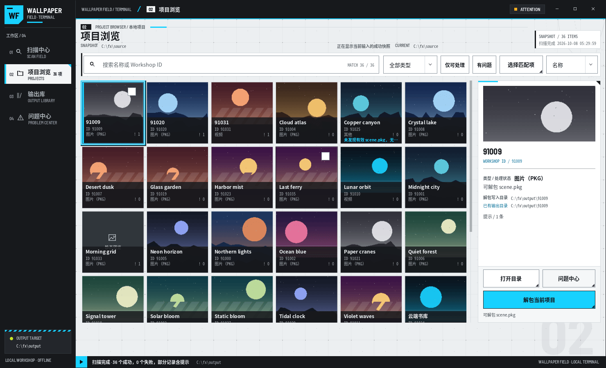

_项目浏览页：方形封面网格、组合筛选与右侧常驻详情。当前项、键盘焦点和批量勾选彼此独立。_

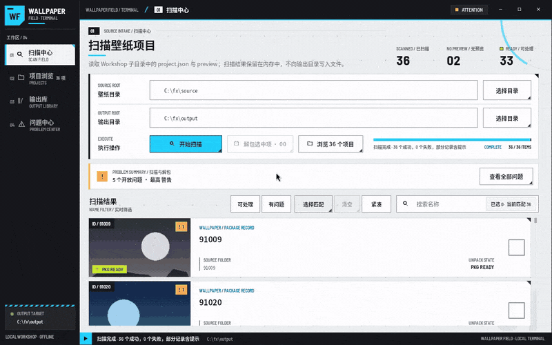

_动效演示：在四个页面间切换时，黑色扫掠条带着青色前缘横过舞台，新页面从右侧滑入，各区块依次升起。系统开启“减少动态效果”时这些动效会全部关闭。_

## 目录

- [v1.4.0 新变化](#v140-新变化)
- [界面一览](#界面一览)
- [功能概览](#功能概览)
- [运行要求](#运行要求)
- [快速开始](#快速开始)
- [使用教程](#使用教程)
- [动效与无障碍](#动效与无障碍)
- [输出目录结构](#输出目录结构)
- [常见问题](#常见问题)
- [从源码构建](#从源码构建)
- [测试](#测试)
- [二次开发](#二次开发)
- [许可证](#许可证)
- [感谢](#感谢)

## v1.4.0 新变化

v1.4.0 是一次界面大改版，扫描、解包、输出库与问题中心的功能和数据格式保持不变。

- **全新「终端浅色」界面**：明亮的纸面工作区，近黑色 L 形边框（左侧导航、顶部标题栏、底部状态栏），单一青色信号色；亮绿色只表示“可处理”，琥珀色表示警告，红色表示错误。
- **丰富动效回归**：页面切换扫掠与滑入、区块依次出现、蓝图网格缓慢漂移、状态灯呼吸、校准环旋转、任务进行中的警示条纹、按钮上浮与导航平移。全部受“减少动态效果”控制。
- **Windows 10 图标修复**：图标字体增加 Segoe MDL2 Assets 回退，Windows 10 上不再显示方框。
- **稳定性与性能**：修复输出库每次刷新都会重复登记同一批问题、预览失败后在滚动时反复重读、后台线程更新问题中心等问题；扫描与解包进度更新更轻量；扫描失败原因更具体；启动失败会显示日志位置；注销或关机时也会保存设置；粘贴带引号的路径会自动去掉引号。

完整列表见 [v1.4.0 发布说明](docs/releases/v1.4.0.md)。

## 界面一览

> 以下截图均由 v1.4.0 程序本身渲染：静态图使用程序内置的 `--snapshot` 离屏截图参数，动图为程序实际运行时的录屏。壁纸封面是程序生成的抽象测试图案，不是真实 Workshop 内容。截图环境使用了替代字体，Windows 实机上的字形会略有差异。

### 扫描中心

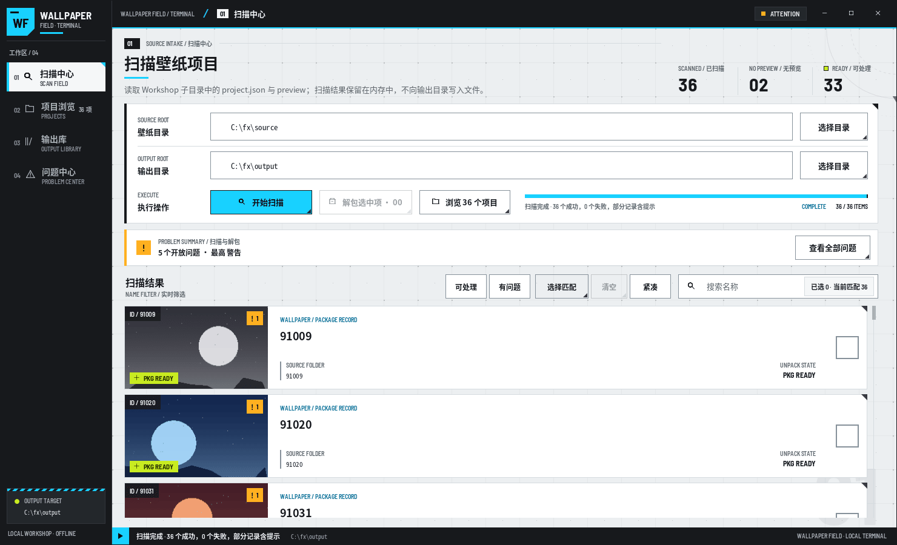

左上角的页码与双语小标题标明当前位置；右侧是“已扫描 / 无预览 / 可处理”统计。白色操作面板带黑色左边框，青色“开始扫描”是本页唯一的主要操作。问题摘要用琥珀色边条提示，卡片上的亮绿色 `PKG READY` 表示可以解包，右侧方框用于勾选。

### 项目浏览


网格按窗口宽度在 3–6 列之间自适应。当前项目有青色描边，右侧详情显示类型、处理状态、解包目标与操作按钮；勾选项目后，底部会出现黑色的批量处理栏。

### 输出壁纸库

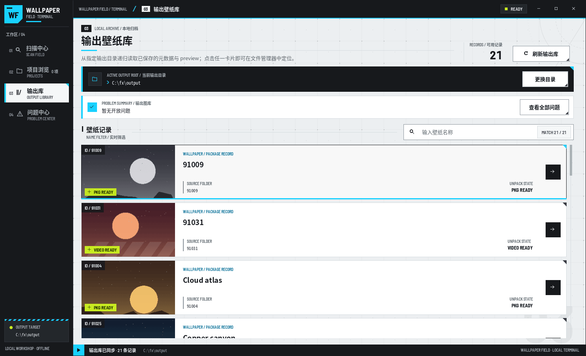

输出库递归读取已处理项目的 `metadata.json`。黑色信息条显示当前输出目录，没有开放问题时摘要显示青色对勾。点击任意卡片即可在资源管理器中打开对应目录。

### 问题中心

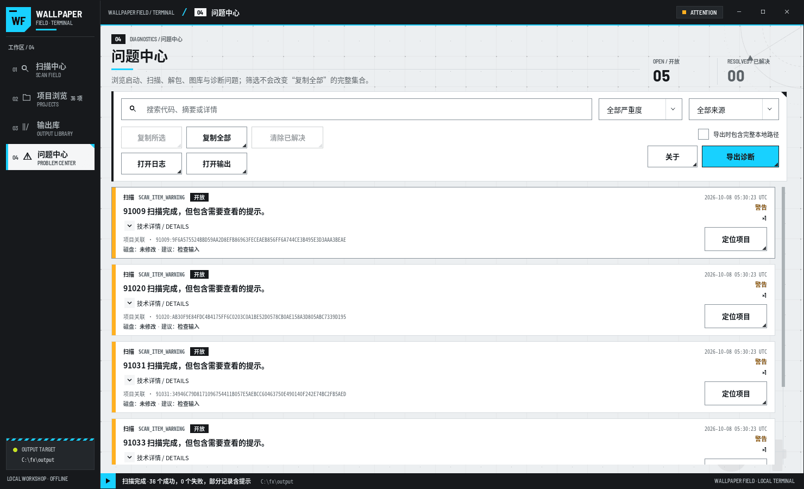

扫描、解包、图库、设置与诊断产生的问题集中在这里。左侧色条区分严重度（琥珀色为警告、红色为错误），可以展开技术详情、复制、清理已解决问题，或导出默认脱敏的诊断 JSON。

### 窄窗口布局

窗口宽度小于 1060 时，导航栏收窄为图标列，统计与说明文字自动隐藏，筛选与详情改用浮层，但所有操作入口都保留。

| 扫描中心 | 项目浏览 | 输出壁纸库 |
| --- | --- | --- |
| 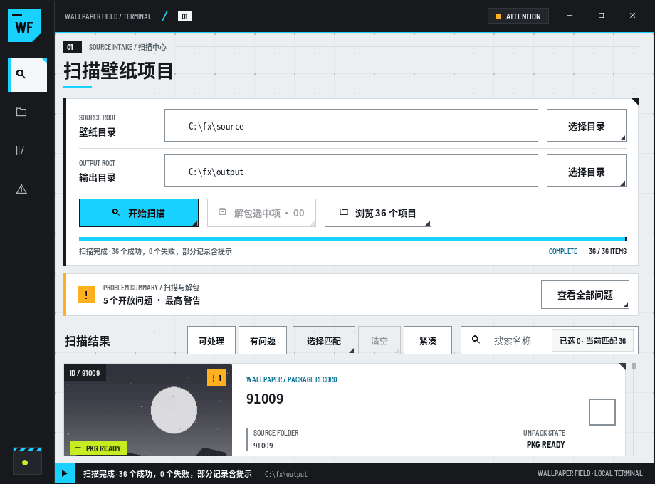 | 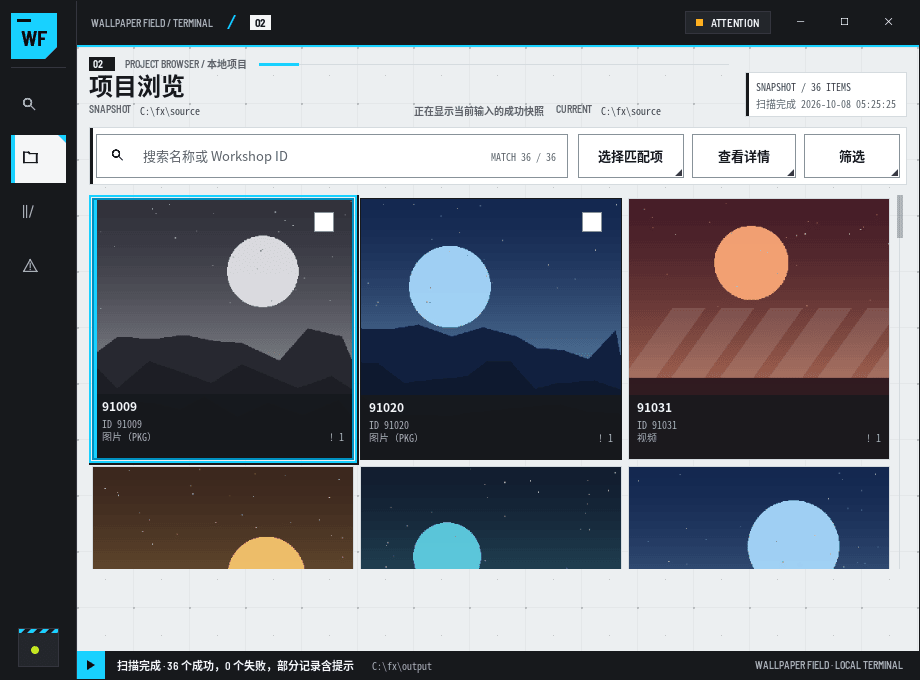 | 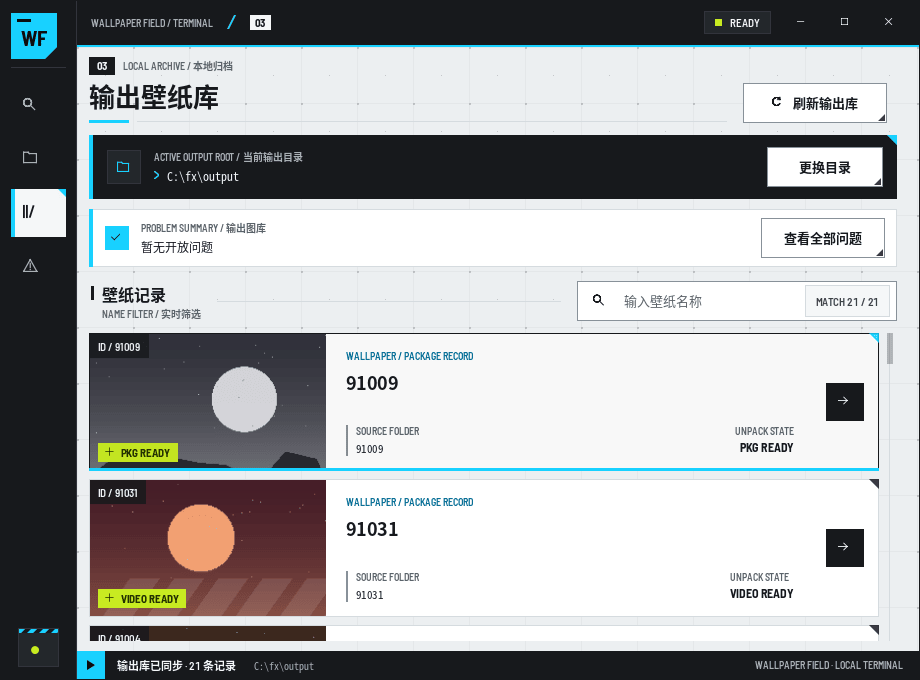 |

### 细节

| 导航与页头 | 扫描卡片 |
| --- | --- |
| 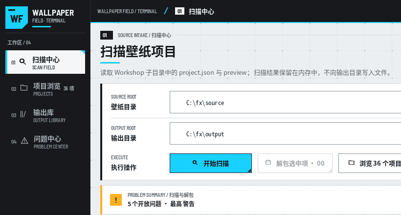 | 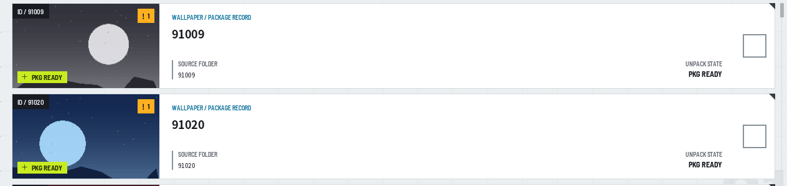 |
| **项目网格** | **问题卡片** |
| 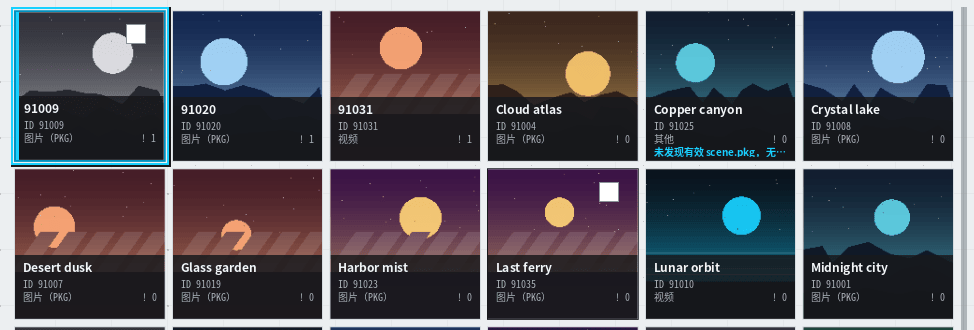 | 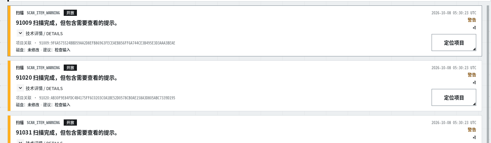 |

## 功能概览

- 只读扫描 Wallpaper Engine Workshop 根目录下的所有直接子文件夹，结果只保存在本次运行的内存中，不会向输出目录写入任何文件。
- 从 `project.json` 读取 `title`、`workshopid`、`type` 和 `file`；字符串或数字形式的 Workshop ID 均可识别。
- 识别 `preview.png`、`preview.jpg`、`preview.jpeg` 和 `preview.gif`，卡片直接读取源文件，不复制预览图。
- 识别项目根目录的 `scene.pkg`，以及 `type` 为 `video` 且 `file` 指向有效相对路径的视频项目。
- 所有卡片默认不勾选；只有勾选的可处理项目才会被解包或复制。
- 使用内置 RePKG 解包 PKG，执行 TEX 图片转换并生成 `.tex-json`；TEX 中间文件转换后即删除，不写入最终壁纸库。
- 新建和更新都先写入隔离的临时目录，内容、清单与 `metadata.json` 一起提交；失败或取消会回滚，既有输出保持不变。
- 「项目浏览」页提供 3–6 列虚拟化网格、标题 / ID 搜索、类型 / 可处理 / 有问题筛选与三种排序；当前项、键盘焦点与批量勾选彼此独立。
- 「输出壁纸库」递归读取已处理项目；重复的 Workshop ID 整组排除并进入问题中心。
- 「问题中心」支持严重度 / 来源 / 文本筛选、复制、清理已解决问题、打开日志 / 输出目录，以及导出默认脱敏的诊断 JSON。
- 正常关闭、注销或关机时记住源目录、输出目录和卡片密度，下次启动自动恢复。
- 大型壁纸库使用回收式虚拟化与后台解码；扫描、解包与刷新都有进度、状态和可见的取消按钮。
- 支持 Windows 高对比度与“减少动态效果”；所有操作都可以用键盘完成。
- 发布版是 Windows x64 自包含单文件 EXE，不需要另外安装 .NET 或 RePKG。

## 运行要求

### 普通用户

- Windows 10 或 Windows 11，64 位系统。
- Wallpaper Engine 的本地 Workshop 内容，或拥有相同目录结构的离线副本。
- 足够的输出磁盘空间。解包后的体积通常会明显大于原始 `scene.pkg`。

正式发布 ZIP 中的 `WallpaperField.exe` 已包含 .NET 运行时和所需的 RePKG 代码。正常使用不需要管理员权限，也不需要单独下载或启动 `RePKG.exe`。仓库根的 `GUI_for_RePKG.exe` 是历史便利副本，可能落后于当前源码；请用 release manifest、About/诊断身份或源码构建结果确认实际版本。

### 从源码构建

- Windows 10/11。
- [.NET 10 SDK](https://dotnet.microsoft.com/download/dotnet/10.0)。

## 快速开始

1. 下载 Windows x64 完整发布 ZIP 并解压后运行 `WallpaperField.exe`；如果直接获取源码，请先按“从源码构建”生成当前版本。
2. 在左侧打开“扫描中心”，选择 Wallpaper Engine 壁纸根目录和一个专门的输出目录。
3. 点击“开始扫描”，等待成功快照和统计信息出现。扫描不会修改输出目录。
4. 打开“项目浏览”，用标题/ID 搜索、类型、仅可处理、仅有问题和排序缩小网格；需要时在扫描中心切换“紧凑”卡片密度。
5. 用方向键移动焦点，Enter 查看当前项，Space 切换批量选择；筛选隐藏的选择仍会保留并在托盘中计数。
6. 在详情中处理当前可处理项，或从批量托盘处理全部已选 `PKG READY` / `VIDEO READY` 项目。
7. 打开左侧“输出壁纸库”，刷新、搜索并浏览已成功处理的内容。
8. 如果页面摘要提示问题，打开“问题中心”查看完整证据、复制详情或导出诊断。

下面是每一步的详细说明。

## 使用教程

### 1. 找到 Wallpaper Engine Workshop 目录

Wallpaper Engine 的 Steam App ID 是 `431960`。默认 Steam 库常见路径为：

```text
C:\Program Files (x86)\Steam\steamapps\workshop\content\431960
```

如果 Steam 库位于其他磁盘，路径通常为：

```text
<SteamLibrary>\steamapps\workshop\content\431960
```

例如：

```text
E:\SteamLibrary\steamapps\workshop\content\431960
```

选择的是 `431960` 这一层，而不是某一个具体数字 ID 的文件夹。程序只扫描它的直接子文件夹，例如：

```text
431960\
├─ 884307090\
├─ 1864604777\
└─ 2390303351\
```

你可以直接在输入框中粘贴路径，也可以点击右侧的目录选择按钮。正常关闭程序后，这两个路径会保存到当前 Windows 用户的本地设置中，并在下次启动时自动恢复；命令行测试参数仍可临时覆盖它们。

### 2. 选择输出目录

输出目录用于保存已勾选且处理成功的项目。建议选择一个专用目录，例如：

```text
D:\WallpaperFieldOutput
```

> [!IMPORTANT]
> 源目录和输出目录不能相同，也不能互相包含。请不要把输出目录放进 `431960`，也不要把 `431960` 放进输出目录；这样可以避免输出文件被再次当成扫描源。

扫描只读取源壁纸目录，既不会创建输出目录，也不会在其中写入任何文件。点击“解包选中项”后，程序才会为已勾选项目创建输出并写入解包内容、视频副本和单项元数据。preview 始终链接到源文件，不会复制到输出目录。若输出内容重要，仍建议定期备份。

### 3. 开始扫描

确认两个路径后，点击“开始扫描”。程序会逐个只读检查 `431960` 下的直接子文件夹，并执行以下操作：

1. 查找并读取 `project.json`。
2. 获取其中的 `title`、`workshopid`、`type` 与 `file`。
3. 查找 preview 图片，并记录其源文件路径供卡片直接显示。
4. 检查项目根目录是否存在 `scene.pkg`，或是否为引用有效文件的 video 项目。
5. 在扫描中心生成对应卡片和复选框。

扫描结果只存在于当前运行会话的内存中。此阶段不会创建输出根目录、项目目录、preview 副本、元数据或索引文件。

卡片会显示：

- preview 图片；没有可用图片时显示“无信息”。
- `title`；无法读取时使用文件夹名作为回退标题。
- `workshopid`；缺失或无效时使用文件夹名作为回退识别码，并显示警告。
- `PKG READY`、`VIDEO READY` 或无可处理内容状态。
- 一个默认未选中的复选框；无可处理内容时复选框不可用。
- 元数据缺失、preview 缺失等非致命警告。

单个项目损坏不会终止整个扫描。完成后请查看扫描页的问题摘要；如有异常，打开“问题中心”查看完整证据、磁盘事实和建议动作。

如果多个源文件夹最终得到相同的 Workshop ID，程序会保留先处理的项目，并把后续重复项记录为失败，避免不同壁纸覆盖到同一个输出目录。

### 4. 使用项目浏览

扫描成功后，打开左侧“项目浏览”。它消费扫描一次性发布的同一份稳定快照；新扫描失败或取消时不会把上一份可用浏览上下文清空。网格支持标题/Workshop ID 搜索、类型、仅可处理、仅有问题和名称/ID/类型排序；按类型排序时固定为 **Package → Video → Website → Other**。

项目类型按安全优先级唯一判定：

1. `type` 为 `web` / `website` 时始终是 Website，只能浏览，当前版本不处理其输出。
2. 声明为 `video` 且 `file` 指向项目内存在的安全相对文件时是 Video，处理时复制该文件。
3. 声明为 `video` 但文件缺失、非法或越界时是 Other；即使目录里碰巧存在 `scene.pkg`，也不会回退为 Package。
4. 其余项目只有在根目录存在有效 `scene.pkg` 时才是 Package；否则是 Other。

“当前项”、键盘焦点和批量选择是三种独立状态。移动焦点或打开详情不会自动勾选；“选择匹配项”会一次选择当前筛选出的全部可处理项目，筛选隐藏的已选项目仍参与批处理，固定托盘会显示总选择数和隐藏选择数。详情中的处理动作只处理当前项，批量动作则使用已冻结的整组选中项；扫描身份、revision、成员和输出目录在真正进入任务槽前会再次校验。动作不可执行时，界面会直接说明正在扫描、快照过期、输出目录变化、已有前台任务或当前类型不可处理等原因。

- 卡片获得焦点后，用方向键在网格移动，Space 切换批量选择，Enter 把该卡设为当前项并进入详情。
- 窄窗口（宽度小于 1060）下 Enter 打开侧边详情；在窄窗口的详情或筛选层按 Escape 会关闭该层，并把焦点恢复到打开它的控件。卡片本身不把 Escape 解释为“返回搜索”。
- 搜索框非空时可用清除按钮恢复全部项目并把焦点还给搜索框。窄窗口把筛选与详情放入独立侧层，但不会隐藏清除、取消或处理等唯一入口。
- 从项目详情打开问题，或从问题中心选择“定位项目”，会按稳定 ProjectKey 跳回精确项目；必要时自动清除阻挡的搜索/类型/问题筛选，而不会改变批量选择。
- “打开文件夹”会在启动 Explorer 前重新验证并锁定目标路径；目标消失、不安全或 Shell 启动失败时，结果会同时显示在页面状态与辅助技术可感知的 live region 中。

项目浏览只显示预览的静态首帧，并在后台 worker 中解码。单个输入最大 64 MiB，宽高各不超过 4096，源画布不超过 16M 像素；同时最多 4 个解码，缓存最多 128 项且估算解码内存最多 128 MiB。缺失、损坏、变化、reparse-point 或超预算预览会安全降级为占位和逐项问题，不会拖垮整个快照。

### 5. 理解输入文件规则

每个壁纸项目的典型结构如下：

```text
884307090\
├─ project.json
├─ preview.png
├─ scene.pkg
└─ ...其他 Wallpaper Engine 文件
```

| 文件 | 是否必需 | 读取方式 |
| --- | --- | --- |
| `project.json` | 建议存在 | 文件名和字段名不区分大小写；读取 `title`、`workshopid`、`type` 与 `file` |
| `preview.*` | 可选 | 只查找项目根目录；支持 PNG、JPG、JPEG、GIF；直接从源文件显示 |
| `scene.pkg` | 场景壁纸必需 | 只识别项目根目录中的同名文件，文件名不区分大小写 |
| `file` 指向的视频 | 视频壁纸必需 | `type` 必须为 `video`；`file` 必须是项目目录内存在的安全相对路径 |

preview 的选择优先级为 PNG → JPG → JPEG → GIF。程序直接读取源 preview。仅扫描中心和输出壁纸库会让当前可见卡片中的 GIF 按原始帧时长与循环设置播放，滚出可视区域后暂停；项目浏览始终只显示受预算保护的静态首帧。系统启用“减少动态效果”时所有页面都保持静态帧。图片数据先读入内存，因此播放期间不会锁住源文件。

一个最小的 `project.json` 示例：

```json
{
  "title": "My Wallpaper",
  "workshopid": "884307090",
  "type": "scene",
  "file": "scene.json"
}
```

视频项目通常使用以下字段：

```json
{
  "title": "My Video Wallpaper",
  "workshopid": "1864604777",
  "type": "video",
  "file": "media/wallpaper.mp4"
}
```

`workshopid` 也可以是 JSON 数字。输出目录以最终识别到的 Workshop ID 命名。视频 `file` 可以包含子目录，但不能是绝对路径，也不能包含 `..` 路径段。

### 6. 勾选并处理壁纸

扫描完成后，每张卡片都会显示复选框且默认不选。勾选至少一个 `PKG READY` 或 `VIDEO READY` 项目后，“解包选中项”按钮会变为可用。点击后：

- 只处理本次扫描中已勾选的可处理项目；未勾选项目不会创建任何输出。
- `scene.pkg` 解压到 `<输出目录>\<workshopid>\unpacked\`。
- `type` 为 `video` 的项目会把 `file` 指定的视频复制到 `<输出目录>\<workshopid>\unpacked\<相对路径>`。
- 单个项目处理成功后，程序才会写入 `<输出目录>\<workshopid>\metadata.json`。该文件保留源 preview 路径，输出目录中不创建 preview 副本。
- 不同 Workshop ID 的内容互不混合。
- 某一个项目失败时会记录错误并继续处理后续已勾选项目；失败项不会写入新的 metadata。
- 新建和更新都先写入隔离 staging；内容、应用清单与 `metadata.json` 一起提交。正常失败或取消会回滚本次动作，既有输出保持不变。
- 可以在操作过程中取消；临时 staging 目录会被清理。进入短暂 commit 临界区后，界面会如实显示正在完成安全提交/回滚，不会把已完成写盘伪装成取消。
- 关闭窗口会先禁止新任务、请求当前任务取消并等待安全清理；超时或设置保存失败会留在问题中心供用户决定，不会强杀仍在写盘的进程。

如果扫描完成后移动、删除或替换了源目录中的 `scene.pkg`、视频或 preview，请重新扫描再处理。如果更改了输出目录，也应重新扫描，以确保卡片记录和目标目录一致。

可处理资格和勾选状态来自当前运行会话中的扫描结果。重新启动程序，或只在“输出壁纸库”中加载旧记录，并不会恢复待处理队列；此时请返回“扫描中心”重新扫描并重新勾选。

#### TEX 转换结果如何保存？

Wallpaper Engine 的 `.tex` 是纹理资源，不是 LaTeX 文档。程序先把当前包内的 TEX 写入隔离的 staging 目录，尝试生成 `.png`、`.jpg`、`.gif` 或 `.mp4`，并生成相应的 `.tex-json` 元数据；随后无论转换成功、失败还是任务取消，都会删除本次任务创建的原始 `.tex` 中间文件。

如果某个纹理无法转换，完成信息中会给出警告，但不会为了失败项保留原始 TEX，也不会阻止其他文件继续解包。程序只清理自己在当前 staging 目录中创建的 TEX，不会递归删除已有输出中的同名文件。

### 7. 浏览输出壁纸库

打开左侧“输出壁纸库”页面。页面会在所选输出根下递归发现已成功处理项目的 `metadata.json`，恢复标题、Workshop ID、源 preview 路径和输出文件夹位置。仅完成扫描不会向输出库添加记录。

- 点击“刷新输出库”可重新读取磁盘内容。
- 点击“更换目录”可浏览另一套输出库。
- 在列表上方输入标题关键词可实时过滤卡片；右侧会显示“匹配数 / 总数”，清空搜索即可恢复全部记录。
- 点击卡片或卡片右侧箭头，会在 Windows 文件资源管理器中打开该项目的输出文件夹。
- 输出库不会进入 reparse-point、`unpacked`、staging 或 backup 目录，因此包内和事务工作树中的同名 JSON 不会被误当成壁纸记录。
- 候选按规范化相对路径稳定排序；同一 Workshop ID（忽略大小写）出现多次时，整组不任选一个展示，而是在问题中心列出全部冲突候选。
- preview 仍从原壁纸目录读取；如果源文件被移动或删除，输出库中的该卡片将无法继续显示预览图。

### 8. 使用问题中心与诊断

问题中心保存当前会话中扫描、解包、图库、输入、设置、日志和诊断操作产生的结构化记录。你可以组合文本、严重度和来源筛选，展开完整详情，复制选中或全部问题，并清理已经解决的记录。重复扫描/刷新成功时，只会精确解决同一来源和上下文的旧问题。

“导出诊断”会生成包含版本、完整源 commit、操作系统、架构、DPI、High Contrast、motion、密度和问题计数的 JSON。默认不包含文件内容，并会移除路径 context、脱敏摘要和详情；只有用户显式选择包含路径时才保留本地路径。日志同样对路径做指纹化，并按大小、数量和保留期轮换。

### 9. 键盘与辅助功能

四个页面的导航、路径、筛选、批量选择、密度、扫描 / 解包 / 刷新 / 取消及问题操作都可以用键盘完成。页面标题提供一级标题语义但不额外占用 Tab；无文字按钮和窄窗口导航都有稳定的中文名称。项目浏览的卡片使用“漫游焦点”，1000 张卡片不会全部进入 Tab 序列，但每张卡片和勾选状态仍可通过键盘与 UI Automation 操作。动效与高对比度的细节见下一节。

## 动效与无障碍

v1.4 恢复了 v1.2 时代的丰富动效，并在其基础上扩展：

| 动效 | 触发时机 | 说明 |
| --- | --- | --- |
| 页面扫掠 | 切换页面 | 一道带青色前缘的黑色斜条横过舞台 |
| 页面滑入 | 切换页面 | 新页面从右侧滑入并淡入 |
| 区块依次出现 | 切换到扫描中心、输出壁纸库、问题中心 | 页头、操作区、摘要与列表依次升起 |
| 蓝图网格漂移 | 一直 | 舞台背景网格以 28 秒为周期缓慢漂移 |
| 状态灯呼吸 | 一直 | 左下角输出目标的状态灯明暗交替 |
| 校准环 | 一直 / 任务进行中 | 右上角校准环缓慢旋转，扫描、解包或刷新时加速并闪烁 |
| 警示条纹 | 任务进行中 | 舞台顶部的黑青条纹持续滚动 |
| 悬停反馈 | 指针悬停 | 按钮轻微上浮，导航项向右平移，离开后自动归位 |

- **减少动态效果**：Windows“设置 → 辅助功能 → 视觉效果 → 动画效果”关闭时，或使用 `--reduced-motion` 启动时，以上动效全部关闭，GIF 预览只显示静态首帧。
- **项目浏览页内部保持静止**：为了保证大量卡片滚动时的性能与焦点定位，项目浏览页只保留页面级的扫掠与滑入，网格与详情内部没有动画。
- **高对比度**：使用 Windows 系统窗口、文本、高亮和禁用颜色；网格、页码水印、校准环与警示条纹等装饰层会自动隐藏。
- **键盘焦点**：方形双层焦点框（外圈黑色、内圈青色），在浅色纸面和黑色导航栏上都清晰可见。
- 所有状态都同时由文字或结构表达，不只依赖颜色、悬停、提示框或动画。

## 输出目录结构

处理过一个场景壁纸和一个视频壁纸后的典型结构如下。扫描本身不会创建这些文件：

```text
用户选择的输出目录\
├─ 884307090\
│  ├─ metadata.json
│  └─ unpacked\
│     ├─ .wallpaper-field-unpack.json
│     ├─ scene.json
│     ├─ materials\example.png
│     ├─ materials\example.tex-json
│     └─ ...包内其他文件与转换产物
└─ 1864604777\
   ├─ metadata.json
   └─ unpacked\
      ├─ .wallpaper-field-unpack.json
      └─ media\
         └─ wallpaper.mp4
```

主要文件的用途：

| 文件 | 用途 |
| --- | --- |
| `<id>/metadata.json` | 成功处理项目的标题、源路径、源 preview、内容类型与警告；输出库以此发现项目 |
| `<id>/unpacked/` | `scene.pkg` 中除 TEX 中间文件外的原始文件、最终纹理转换产物，或复制后的视频文件 |
| `.wallpaper-field-unpack.json` | 本次处理结果的应用清单 |

`metadata.json` 是每个成功项目的持久化记录。后续接入数据库、HTTP API、队列或自己的后端时，可以直接消费这些 JSON，也可以替换程序中的服务实现。程序不再生成根索引或 Workshop ID 清单。

> [!WARNING]
> 重复扫描不会修改输出目录。重复处理属于更新/覆盖操作，不是严格的目录镜像清理；新包中已不存在的旧解包文件，以及旧版本曾经保留的 TEX，可能继续存在。为避免误删用户文件，本版本不会追溯清理无法证明归属的旧 TEX。需要完全干净、可比对的结果时，请选择一个新的空输出目录。

## 常见问题

### “开始扫描”按钮不可用

请确认源目录和输出目录都已填写、源目录存在、两者没有互相包含，并确认程序当前没有执行其他扫描或处理任务。扫描不会创建不存在的输出目录；该目录会在处理已勾选项目时按需创建。

### “解包选中项”按钮不可用

当前会话必须先成功完成一次扫描，并至少勾选一个 `PKG READY` 或 `VIDEO READY` 项目。所有项目默认不选。重启程序、扫描后更改输出目录，或只加载旧输出库时，都需要重新扫描并重新勾选。

### 扫描完成后为什么输出目录仍然为空？

这是预期行为。扫描只读取源目录并在内存中生成卡片，不会创建任何输出。只有勾选可处理项目并点击“解包选中项”，且该项目成功处理后，程序才会写入对应内容和 `metadata.json`。

### 扫描到了文件夹，但没有标题或 Workshop ID

通常是 `project.json` 缺失、JSON 损坏，或对应字段为空。程序会使用文件夹名作为回退值，并在扫描页摘要与问题中心列出原因。修复源文件后重新扫描即可。

### 卡片显示“无信息”

项目根目录中没有名为 `preview` 的受支持图片，或者图片已损坏。请检查文件是否为 `preview.png`、`preview.jpg`、`preview.jpeg` 或 `preview.gif`。其他文件名不会被自动选作 preview。

### 某些项目没有被解包

只有已勾选的 `PKG READY` 或 `VIDEO READY` 项目才会进入处理队列。未勾选项目不会产生输出；没有有效 PKG 或视频的卡片无法勾选。如果扫描后才添加或替换源文件，请重新扫描。

### 视频项目为什么没有被复制？

请检查 `project.json` 顶层的 `type` 是否为 `video`，`file` 是否为项目目录内存在的相对路径，并确认对应卡片已勾选。为防止路径穿越，绝对路径、包含不安全路径段或指向项目目录之外的文件会被拒绝。

### 为什么旧输出目录中仍然有 `.tex`？

这通常是旧版本或其他工具留下的文件。本版本保证当前解包任务创建的 TEX 在提交最终结果前删除，但不会自动删除既有输出中无法确认归属的文件。需要清理旧结果时，请先备份后手动处理，或改用新的空输出目录重新解包。

### GIF 为什么暂停或只显示静态帧？

GIF preview 不会复制到输出目录。扫描中心和输出壁纸库的可见卡片会逐帧播放，滚出可视区域或页面隐藏后会自动暂停并在再次可见时继续；项目浏览始终只解码静态首帧。如果 Windows 启用了“减少动态效果”，程序会尊重系统设置并让所有页面保持静态帧；损坏或不受支持的 GIF 会显示占位状态。

### 在哪里查看完整错误或导出诊断？

扫描与图库页只显示紧凑问题摘要。打开左侧“问题中心”，可筛选、展开和复制完整记录，并使用“导出诊断”生成默认脱敏 JSON。日志、输出根和 About/版本身份也从该页进入；不要只依赖被截断的卡片提示判断磁盘状态。

### Windows SmartScreen 提示未知发布者

当前社区构建可能未使用商业代码签名证书。请只从可信发布页下载，核对仓库来源和发布附件；不确定时可以从源码自行构建。不要运行来源不明的同名 EXE。

### 怎样关闭界面动效？

在 Windows“设置 → 辅助功能 → 视觉效果”中关闭“动画效果”，程序会立即停止所有动效；也可以用 `--reduced-motion` 参数启动。关闭后功能完全一致。

### Windows 10 上图标显示为方框？

v1.4.0 已修复：图标字体会在缺少 Windows 11 的 Segoe Fluent Icons 时自动改用 Windows 10 自带的 Segoe MDL2 Assets。如果仍显示异常，请确认系统字体没有被精简工具删除。

### 界面字体看起来和截图不一样？

界面优先使用 Windows 自带的 Bahnschrift、微软雅黑与 Cascadia Mono / Consolas，缺少时自动回退。README 中的截图在替代字体环境下渲染，字形会与 Windows 实机略有差异。

## 从源码构建

在项目根目录执行：

```powershell
dotnet restore .\WallpaperField.slnx --configfile .\NuGet.Config
dotnet build .\WallpaperField.slnx --configuration Release
.\bin\Release\net10.0-windows\WallpaperField.exe
```

生成 Windows x64 自包含单文件版本：

```powershell
$candidate = Join-Path $PWD 'artifacts\WallpaperField-v1.4.0-local'
.\build-release.ps1 -OutputDirectory $candidate
Get-ChildItem -LiteralPath $candidate
```

也可以从 `cmd.exe` 调用同一流程：

```bat
build-release.cmd artifacts\WallpaperField-v1.4.0-local
```

输出目录必须是尚不存在的专用目录。脚本先在同卷 GUID 工作区 restore/publish，验证 PE 版本、真实启动截图、ZIP 精确内容、许可 hash、依赖 JSON、Authenticode 状态与 SHA-256 后，才一次性发布候选目录。默认流程不会覆盖仓库根 `GUI_for_RePKG.exe`。

候选目录包含：

```text
WallpaperField.exe
WallpaperField-v1.4.0-win-x64.zip
release-manifest.json
dependencies.json
SHA256SUMS
```

对外分发单位是 ZIP，而不是孤立 EXE。ZIP 内含 EXE、release notes、根许可/notices、RePKG 许可/notices/本地补丁记录、build manifest 与完整机器可读依赖清单。没有代码签名证书时，manifest 会明确记录 `NotSigned`，并由外部 `SHA256SUMS` 提供 EXE 与 ZIP hash。

`-UpdateTrackedExecutable` 只用于候选已经通过全部门禁后的有意根 EXE 更新；普通构建和 CI 不使用该开关。RePKG、XamlAnimatedGif 和 .NET 运行时会链接到候选 EXE 中。

> [!IMPORTANT]
> 对外分发时请使用脚本生成并验证的完整 ZIP；不要只上传一个孤立的 EXE，也不要手工省略许可、补丁记录、manifest 或依赖清单。

## 测试

运行不依赖第三方测试框架的端到端烟雾测试；其中包含路径设置持久化、搜索过滤、GIF 多帧播放/暂停/文件解锁和 TEX 清理边界检查：

```powershell
dotnet run --project .\tests\WallpaperField.SmokeTests\WallpaperField.SmokeTests.csproj --configuration Release
```

成功运行的最后一行是可由 CI 严格解析的摘要，例如：

```text
SMOKE_RESULT tests=1 assertions=10743 passed=1 failed=0
```

断言数量会随回归用例增加；`tests` 和 `assertions` 必须都大于零。可用下面的专用自检证明断言失败会返回非零退出码：

```powershell
dotnet run --project .\tests\WallpaperField.SmokeTests\WallpaperField.SmokeTests.csproj --configuration Release -- --verify-failure-exit
```

仓库的 Windows CI 会显式执行并解析这个 harness。当前项目不是标准 Test SDK 项目；本版本实测 `dotnet test WallpaperField.slnx` 退出 0 但执行 0 项，因此它不能代替上述 SmokeTests 门禁。

使用真实 `scene.pkg` 做抽样解包：

```powershell
dotnet run --project .\tests\WallpaperField.SmokeTests\WallpaperField.SmokeTests.csproj --configuration Release -- "D:\path\to\scene.pkg" "D:\test-output"
```

也可以传入 Wallpaper Engine 内容根目录，对其中的 PKG 做只读兼容性检查：

```powershell
dotnet run --project .\tests\WallpaperField.SmokeTests\WallpaperField.SmokeTests.csproj --configuration Release -- "E:\SteamLibrary\steamapps\workshop\content\431960"
```

程序还保留了用于自动视觉验收的非持久化启动参数：

```text
--source <目录> --output <目录> --scan
--page scan|browse|library|problems
--snapshot <png路径> --width <像素> --height <像素>
--scroll-index <记录索引>
--reduced-motion
```

这些参数只用于截图和回归测试，不会改变普通用户的使用流程。

所有带值参数都不会把下一个 `--flag` 当作缺失值；首个合法重复值生效，未知、重复和非法参数会成为 Startup 问题。`--page` 接受 `scan` / `01`、`browse` / `02`、`library` / `03`、`problems` / `04`；宽高必须是有限正数且不大于 16384。启动参数包含路径时，普通日志只记录参数数量与问题数量，不记录完整命令行。

## 二次开发

界面状态、文件系统逻辑和系统交互通过 `Contracts/` 下的接口分离。默认实现集中在 `Services/`，依赖组合入口位于 `Composition/AppComposition.cs`。你可以替换扫描、输出库、目录选择、文件管理器或解包服务，而不必重写页面 XAML。

界面主题按 `Themes/Tokens.xaml`（颜色、字体、尺寸）、`Themes/AccessibilityMotion.xaml`（高对比度与焦点）、`Themes/BaseControls.xaml`（通用控件）和 `Themes/DomainComponents.xaml`（导航、卡片、面板）四层组织；页面切换与环境动效在 `MainWindow.xaml.cs` 中，悬停动效由 `Controls/MotionAssist.cs` 提供，并统一受“减少动态效果”控制。

更完整的扩展说明见 [docs/EXTENDING.md](docs/EXTENDING.md)。新增后端时建议：

- 保持现有 JSON 字段向后兼容，必要时提高 `metadata.json` 的 `schemaVersion`。
- 不要把密码、访问令牌或用户隐私信息写入公开的 `metadata.json`。
- 将耗时 I/O 保持为异步操作，并传递取消令牌与进度。
- 继续保留逐项错误隔离、输出边界检查和路径穿越防护。

欢迎提交 Issue、Pull Request，或 fork 后改造成适合自己工作流的版本。

## 许可证

Wallpaper Field 自行创作的代码以 [MIT License](LICENSE) 发布。你可以使用、复制、修改、合并、发布和再分发，但必须保留 MIT 版权与许可声明。

第三方代码和依赖仍适用其各自的许可证。RePKG 与 XamlAnimatedGif 的许可和依赖声明位于 [THIRD-PARTY-NOTICES.md](THIRD-PARTY-NOTICES.md)、[ThirdParty/RePKG/LICENSE.txt](ThirdParty/RePKG/LICENSE.txt) 与 [ThirdParty/RePKG/THIRD-PARTY-NOTICES.txt](ThirdParty/RePKG/THIRD-PARTY-NOTICES.txt)；相对 RePKG 0.4.0 的本地安全补丁记录见 [ThirdParty/RePKG/UPSTREAM-PATCHES.md](ThirdParty/RePKG/UPSTREAM-PATCHES.md)。本项目的 MIT 许可证不会替代这些第三方条款。

## 感谢

- 感谢 [notscuffed/RePKG](https://github.com/notscuffed/repkg) 提供 MIT 许可的 Wallpaper Engine PKG 读取与 TEX 转换实现。本项目在保留上游许可和版权声明的前提下，将相关核心能力集成到 C# 桌面程序中。
- 感谢 [XamlAnimatedGif/XamlAnimatedGif](https://github.com/XamlAnimatedGif/XamlAnimatedGif) 提供 Apache-2.0 许可的 WPF GIF 动画播放能力。
- 感谢 [Brandon030722/ark-ui-skill](https://github.com/Brandon030722/ark-ui-skill) 提供 clean-room 的鹰角系界面设计方法。v1.4 采用其中的 `ark`（明日方舟式工业信息系统）方向，参考了它对黑色边框、青色信号色、页码标签、切角几何与揭示式动效的整理，帮助确定了浅色界面的信息层级、色彩与动效。该仓库仅作为设计过程参考，不是本程序的运行时依赖，本项目也未打包官方游戏素材。

也感谢所有愿意测试、报告问题和继续改造本项目的人。基于 MIT 许可证，欢迎自由 fork、修改和再发布；请在传播衍生版本时保留必要的版权、许可与第三方致谢。
